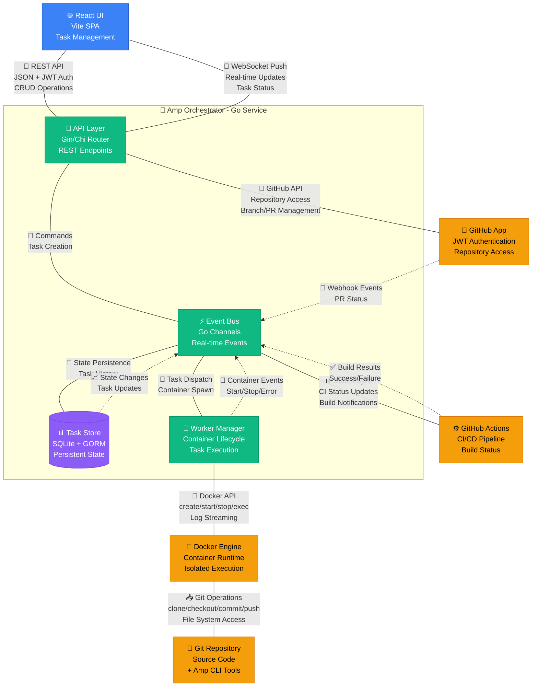

# Amp Orchestrator Architecture Overview

This diagram shows the main components and their relationships in the Amp Orchestrator system.

## Key Components

### Frontend Layer
- **React UI**: Modern SPA built with Vite for fast development and deployment
- **Real-time Updates**: WebSocket connection for live task status and log streaming

### Orchestrator Core (Go)
- **API Layer**: RESTful endpoints using Gin or Chi router with JWT authentication
- **Event Bus**: Go channels for internal communication and event distribution
- **Task Store**: SQLite database with GORM for task persistence and history
- **Worker Manager**: Container lifecycle management and task execution coordination
- **CI Monitor**: Continuous polling of GitHub Actions for build status and feedback

### External Integrations
- **Docker Engine**: Isolated task execution environment with long-running containers
- **GitHub App**: Repository access and PR management
- **CI/CD Pipeline**: GitHub Actions integration with automatic retry feedback loop
- **Git Repository**: Source code management with Amp CLI tools

## Autonomous CI Feedback Loop

A key differentiator of the Amp Orchestrator is its **autonomous feedback loop** with CI systems:

1. **Long-Running Containers**: Amp instances stay alive across multiple CI attempts
2. **CI Monitoring**: Orchestrator continuously polls GitHub Actions for results
3. **Error Analysis**: Failed CI runs are parsed into actionable feedback
4. **Iterative Fixing**: Amp automatically addresses CI failures and retries
5. **Bounded Execution**: Maximum retry limits prevent infinite loops

This enables Amp to deliver **production-ready code** by automatically fixing test failures, build errors, and lint warnings until all CI checks pass.

> 📋 **See [CI Feedback Loop Architecture](./ci-feedback-loop.md) for detailed implementation**
