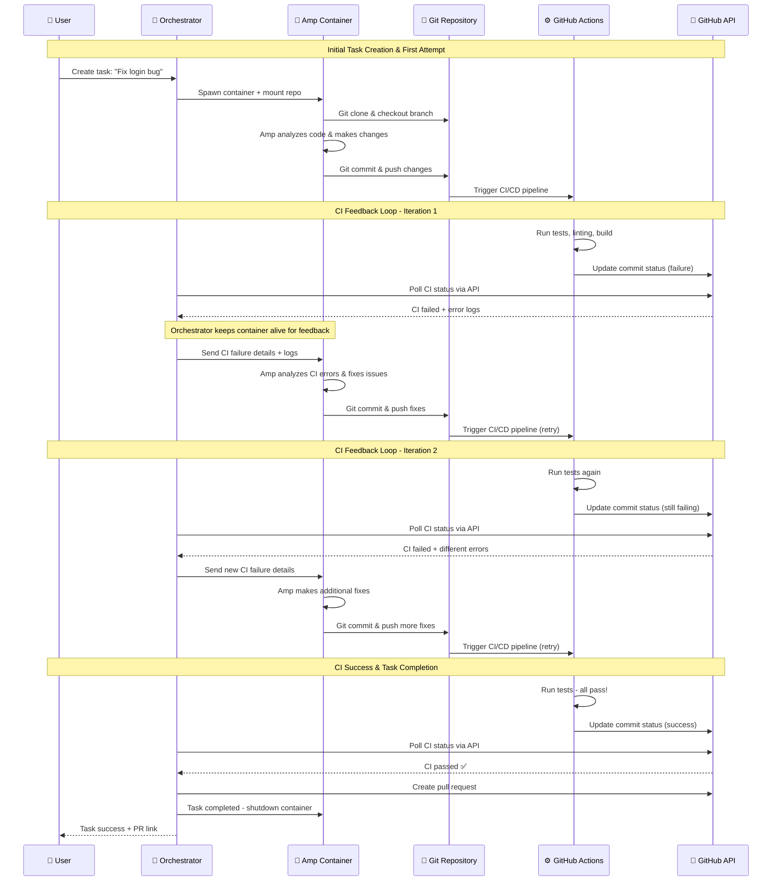
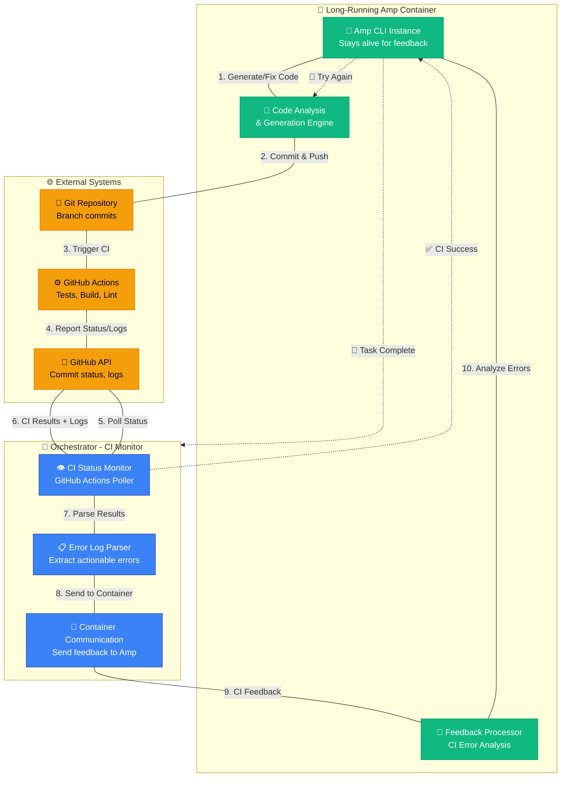

# CI Feedback Loop Architecture

This document details how the Amp Orchestrator implements an autonomous feedback loop with CI systems to iteratively fix code until all tests pass.

## Overview

The key innovation of the Amp Orchestrator is its ability to keep container instances alive and continuously improve code based on CI feedback. Unlike traditional CI systems that simply report pass/fail, Amp actively fixes issues and retries until success.

## Feedback Loop Sequence



## Component Architecture



## Implementation Details

### 1. Long-Running Container Strategy

The orchestrator maintains container instances for the duration of the task, not just a single execution:

```go
type TaskExecution struct {
    containerID   string
    ampProcess    *exec.Cmd
    feedbackChan  chan CIFeedback
    status        TaskStatus
    attempts      int
    maxAttempts   int
}

// Container stays alive until task truly completes
func (w *Worker) executeTask(task *Task) {
    container := w.createAmpContainer(task)
    defer container.cleanup() // Only cleanup on true completion
    
    execution := &TaskExecution{
        containerID:  container.ID,
        maxAttempts:  5, // Configurable retry limit
    }
    
    for execution.attempts < execution.maxAttempts {
        execution.attempts++
        
        // Run Amp CLI with current prompt + previous feedback
        result := w.runAmpInContainer(container, task.prompt, execution.feedback)
        
        // Wait for CI results with timeout
        ciResult := w.waitForCI(task.branch, 10*time.Minute)
        
        if ciResult.Success {
            w.createPR(task)
            return // Task complete!
        } else {
            // Parse CI errors and prepare feedback for next iteration
            execution.feedback = w.parseCIErrors(ciResult)
            w.updateTaskStatus(task, "retrying", execution.attempts)
        }
    }
    
    // Max attempts reached - mark as failed
    w.updateTaskStatus(task, "failed", execution.attempts)
}
```

### 2. CI Status Monitoring

The orchestrator continuously polls GitHub Actions for status updates:

```go
type CIMonitor struct {
    github     *github.Client
    pollTicker *time.Ticker
    callbacks  map[string]func(CIResult)
    watchList  map[string]*WatchedBranch
}

type WatchedBranch struct {
    repo       string
    branch     string
    lastCommit string
    callback   func(CIResult)
}

func (cm *CIMonitor) watchBranch(repo, branch string, callback func(CIResult)) {
    watchKey := fmt.Sprintf("%s/%s", repo, branch)
    cm.watchList[watchKey] = &WatchedBranch{
        repo:     repo,
        branch:   branch,
        callback: callback,
    }
    
    go func() {
        for range cm.pollTicker.C {
            cm.checkBranchStatus(watchKey)
        }
    }()
}

func (cm *CIMonitor) checkBranchStatus(watchKey string) {
    watched := cm.watchList[watchKey]
    
    // Get latest commit and its CI status
    commit := cm.github.GetLatestCommit(watched.repo, watched.branch)
    status := cm.github.GetCIStatus(watched.repo, commit.SHA)
    
    // Only process if status changed from "pending"
    if status.State != "pending" && commit.SHA != watched.lastCommit {
        watched.lastCommit = commit.SHA
        
        result := CIResult{
            Success:    status.State == "success",
            CommitSHA:  commit.SHA,
            Logs:       cm.getCILogs(status.RunID),
            Errors:     cm.parseErrors(status),
            TestResults: cm.getTestResults(status.RunID),
        }
        
        watched.callback(result)
    }
}
```

### 3. Structured Feedback Communication

The orchestrator sends structured feedback to the Amp container:

```go
type CIFeedback struct {
    Attempt       int           `json:"attempt"`
    Success       bool          `json:"success"`  
    PreviousError string        `json:"previous_error,omitempty"`
    Errors        []CIError     `json:"errors"`
    TestResults   []TestFailure `json:"test_failures"`
    BuildLogs     string        `json:"build_logs"`
    LintWarnings  []LintIssue   `json:"lint_warnings"`
}

type CIError struct {
    Type        string `json:"type"`        // "test_failure", "build_error", "lint_error"
    File        string `json:"file"`
    Line        int    `json:"line"`  
    Column      int    `json:"column"`
    Message     string `json:"message"`
    Code        string `json:"code"`        // Error code if available
    Suggestion  string `json:"suggestion"`  // AI-generated suggestion
}

type TestFailure struct {
    TestName    string `json:"test_name"`
    TestFile    string `json:"test_file"`
    Expected    string `json:"expected"`
    Actual      string `json:"actual"`
    Assertion   string `json:"assertion"`
    StackTrace  string `json:"stack_trace"`
}
```

### 4. Amp Feedback Processing

The Amp CLI receives and processes feedback within the container:

```bash
# Orchestrator communicates with Amp via JSON over stdin/stdout
echo '{"attempt":2,"success":false,"errors":[...]}' | amp continue --feedback-mode

# Amp commands for processing different types of feedback
amp analyze-ci-failures --feedback=ci_feedback.json
amp fix-test-failures --test-results=test_failures.json  
amp fix-build-errors --build-logs=build_output.log
amp fix-lint-warnings --lint-report=lint_results.json

# Amp commits the fixes with descriptive messages
amp commit --message="Fix CI failures (attempt 2): resolve test assertions in UserService"
```

## Benefits of This Architecture

### 1. Autonomous Problem Solving
- **No Manual Intervention**: Amp automatically fixes CI failures without human involvement
- **Context Preservation**: Full task context maintained across retry attempts
- **Learning from Errors**: Each failure provides specific, actionable feedback

### 2. Efficient Resource Usage
- **Container Reuse**: Same container instance handles multiple iterations
- **Targeted Fixes**: Only address specific CI failures, not rebuild everything
- **Bounded Execution**: Maximum retry limits prevent infinite loops

### 3. High Success Rate
- **Iterative Improvement**: Each attempt builds on previous learnings
- **Comprehensive Error Handling**: Handles test failures, build errors, lint warnings
- **Smart Retry Logic**: Different strategies based on error types

### 4. Transparency & Debugging
- **Full Audit Trail**: Every attempt and fix is tracked
- **Real-time Updates**: UI shows live progress through retry cycles
- **Detailed Logs**: Complete history of what was tried and why

## Configuration Options

```yaml
# orchestrator.yml
ci_feedback:
  max_attempts: 5
  ci_timeout: "10m"
  poll_interval: "30s"
  
  error_parsing:
    test_frameworks: ["jest", "pytest", "go_test", "rspec"]
    build_tools: ["webpack", "vite", "go_build", "maven"]
    linters: ["eslint", "golint", "flake8", "rubocop"]
  
  retry_strategies:
    test_failure: "fix_and_retry"
    build_error: "analyze_and_fix"
    lint_warning: "auto_fix"
    timeout: "extend_and_retry"
```

This feedback loop architecture enables Amp to deliver production-ready code by automatically addressing CI failures, significantly reducing the manual effort required to get code into a mergeable state.
