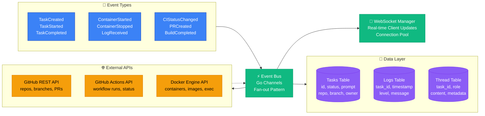

# Amp Orchestrator Event & Data Flow

This diagram shows the internal event bus architecture and data persistence layer.



## Event Architecture

### Event Bus (Go Channels)
The event bus uses Go's channel system with a fan-out pattern to distribute events to multiple subscribers:

```go
type EventBus struct {
    subscribers map[EventType][]chan Event
    mutex       sync.RWMutex
}

type Event struct {
    Type      EventType
    TaskID    string
    Payload   interface{}
    Timestamp time.Time
}
```

### Event Types

#### Task Events
- **TaskCreated**: New task submitted by user
- **TaskStarted**: Worker begins execution  
- **TaskCompleted**: Task finished (success/failure)
- **TaskPaused**: Task waiting for user input
- **TaskResumed**: Task continues after user input

#### Container Events  
- **ContainerStarted**: Docker container launched
- **ContainerStopped**: Container execution finished
- **LogReceived**: New log output from container
- **ContainerError**: Container execution error

#### External Events
- **CIStatusChanged**: GitHub Actions status update
- **PRCreated**: Pull request created successfully
- **BuildCompleted**: CI/CD pipeline finished
- **WebhookReceived**: GitHub webhook event

### Data Persistence

#### Tasks Table
```sql
CREATE TABLE tasks (
    id TEXT PRIMARY KEY,
    status TEXT NOT NULL,
    prompt TEXT NOT NULL,
    repo TEXT NOT NULL,
    branch TEXT,
    owner TEXT NOT NULL,
    pr_url TEXT,
    created_at TIMESTAMP,
    updated_at TIMESTAMP
);
```

#### Logs Table  
```sql
CREATE TABLE logs (
    id INTEGER PRIMARY KEY,
    task_id TEXT NOT NULL,
    timestamp TIMESTAMP NOT NULL,
    level TEXT NOT NULL,
    message TEXT NOT NULL,
    source TEXT,
    FOREIGN KEY (task_id) REFERENCES tasks(id)
);
```

#### Thread Table
```sql
CREATE TABLE threads (
    id INTEGER PRIMARY KEY,
    task_id TEXT NOT NULL,
    role TEXT NOT NULL,
    content TEXT NOT NULL,
    metadata JSON,
    timestamp TIMESTAMP NOT NULL,
    FOREIGN KEY (task_id) REFERENCES tasks(id)
);
```

### WebSocket Real-time Updates

The WebSocket manager maintains connections to active UI clients and pushes relevant events:

```go
type WSManager struct {
    clients   map[string]*WSClient
    broadcast chan WSMessage
    register  chan *WSClient
    unregister chan *WSClient
}

type WSMessage struct {
    Type    string      `json:"type"`
    TaskID  string      `json:"taskId,omitempty"`
    Data    interface{} `json:"data"`
}
```
