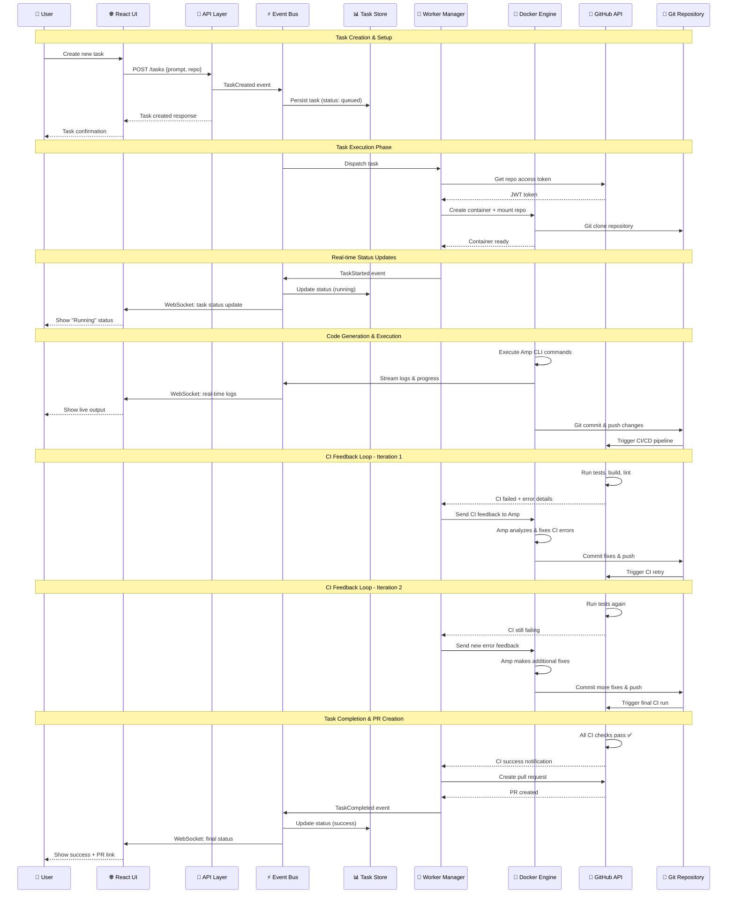

# Amp Orchestrator Task Lifecycle

This sequence diagram shows how a typical task flows through the system from creation to completion, including the CI feedback loop that is central to Amp's value proposition.

## Flow Breakdown

### 1. Task Creation (User → System)
- User submits a new coding task through the React UI
- API validates request and creates task record
- Event bus notifies all components of new task
- Task is queued for execution

### 2. Task Execution Setup
- Worker manager receives task dispatch
- Authenticates with GitHub for repository access
- Spins up isolated Docker container
- Clones target repository into container

### 3. Real-time Communication
- WebSocket connection provides live updates to UI
- User sees immediate status changes
- Log streaming shows progress in real-time

### 4. Code Generation
- Amp CLI executes within Docker container
- Generates code changes based on user prompt
- Streams output and progress back to orchestrator
- Commits and pushes changes to trigger CI

### 5. CI Feedback Loop (Key Differentiator)
- CI pipeline runs automatically on pushed changes
- **If CI fails**: Orchestrator sends structured error feedback to Amp
- Amp analyzes CI errors and makes targeted fixes
- Process repeats until all CI checks pass
- **Container stays alive** throughout the entire feedback cycle

### 6. Completion & Integration
- Only after **all CI checks pass** does task complete
- Pull request is created with production-ready code
- Final status update sent to user with PR link

## Key Innovation: CI Feedback Loop

The sequence above shows **the typical Amp Orchestrator task lifecycle**, which includes automatic CI failure detection and fixing. This is what differentiates Amp from traditional CI systems:

- **Traditional CI**: Code → CI fails → Manual developer intervention required
- **Amp Orchestrator**: Code → CI fails → **Automatic analysis & fixes** → Retry until success

> 📋 **For detailed implementation of the CI feedback loop**, see [CI Feedback Loop Architecture](./ci-feedback-loop.md)
